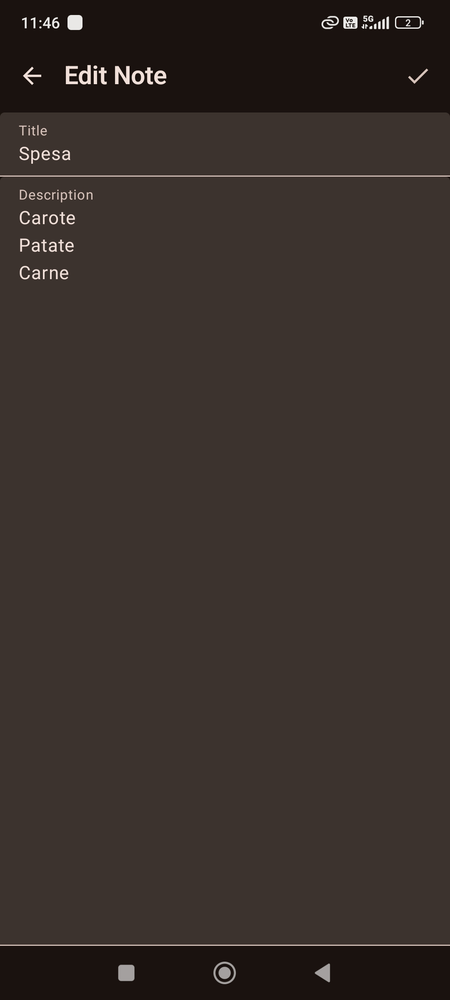

# MyNoteApp
Questo è la ricreazione del progetto JetpackComposeApp che ho dovuto abbandonare per problemi di incompatibilità tra AGP 9 (Gradle 9) e KSP.

Il progetto attuale utilizza una versione stabile di Gradle 8.

Inizialmente nato come semplice esercitazione sulla creazione di app Android nativo in Jetpack compose.

L'app è un semplice Note che ha alcune funzionalità come la creazione di note con titolo e descrizione, edit di una nota e l'eliminazione di una nota.

Schermata principale:

Schermata di dettagli0:

MVVM è un'ottima architettura per isolare la UI dal business logic. Per progetti più grandi penso che MVI (intent) potrebbe essere più utile in quanto preferisco usare actions che sono più esplicite.

Le note vengono salvate in un database local tramite Room che è un'ottima dipendenza. Permette la creazione di un database partendo dalle classi e Entity e offre meccanismi per interagire con esso tramite un'interfaccia chiamato Dao (ha molte funzionalità astratte che permette il facile utilizzo e offre anche la possibilità di scrivere query personalizzate.

Room inoltre implementa anche della logica per favorire l'integrazione con il ViewModel. In particolare nel mio caso aggiungendo "Flow" come return type direttamente alle funzioni del Dao, si può leggere direttamente i dati e il cambiamento di stato ogni volta che si aggiorna la tabella nel database.

Inizialmente non avevo pianificato di usare Dependency Injection perchè non pensavo sarebbe servito in questo piccolo progetto di esercitazione.

Però dato che per comunicare con Room bisogna instanziare una classe del Database e passare l'istanza al repository, mi sono reso conto che avere Dagger hilt per la conteinerizzazione e inject di dipendenze sarebbe stato molto utile.

Ho iniziato a leggere la documentazione di Dagger hilt e fortunatamente è molto più semplice di come mi aspettavo. Basta settare le Entry point e marchiare con la keyword 1@Inject i costruttori delle classi in cui vuoi sottoscrivere a Hilt e lui in automatico si occupa di "iniettare" ai servizi che lo richiedono sempre tramite dei keyword.

Nel mio caso l'istanza del Database veniva creato tramite una funzione builder() quindi non si poteva usare il metodo @Inject. Dagger hilt in questo caso offre il "Module" che permette di istanziare in modo più personalizzato. Ho creato quindi un singleton del Db che poi viene passato al repository.

Il view model a sua volta ricere l'istanza del repository tramite dependency injection.

Ho trovato lo sviluppo in android molto interessante ed è stato bello riscoprire alcuni paradigmi della programmazione usata anche in altri linguaggi.

Chi è interessato può scaricare e usare il progetto, fare pull request per la miglioria di UI, aggiunta di search bar, sistemare le stringhe anche in più lingue o pulizia di codice. 
