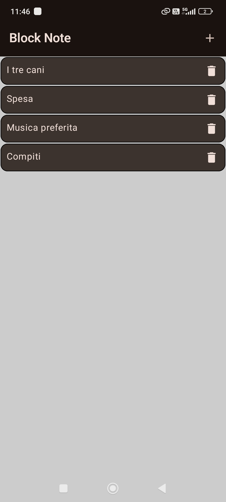

# MyNoteApp
Questo è la ricreazione del progetto JetpackComposeApp che ho dovuto abbandonare per incompatibilità di dipendenze con AGP 9 (Gradle 9) e KSP.

Il progetto attuale utilizza una versione stabile di Gradle 8.

Inizialmente nato come semplice esercitazione sulla creazione di app Android nativo in Jetpack compose.

L'app è un semplice Note che ha alcune funzionalità come la creazione di note con titolo e descrizione, edit di una nota e l'eliminazione di una nota.

Schermata principale:

